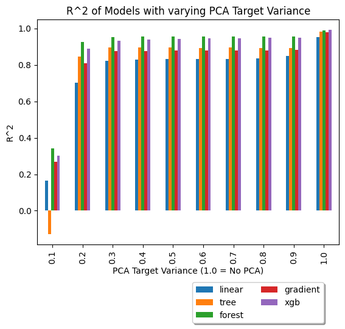

# Philadelphia Housing Data Analysis
This report is an analysis of housing data in Philadelphia. The goal of this project is to create a model that can predict the market value of a property in Philadelphia. For details of the implementation of the models, please read through the `project.ipynb` Jupyter notebook for descriptions of each step through the process.

## Data Collection
The data for this project was gathered from the Philadelphia OPA Property Assesments dataset. The dataset was downloaded from the [OpenDataPhilly](https://www.opendataphilly.org/dataset/opa-property-assessments) website. The dataset contains information on property assessments in Philadelphia. The dataset contains 81 columns and 583,000 rows. The dataset was downloaded as a CSV file and was read into a pandas dataframe for analysis. I also considered scrapping data from the Zillow API, but the process for gaining access to the data was not as easy as just using the public housing data from OpenDataPhilly.

The data in this dataset contained primarily property inspection data for all types of properties in Philadelphia. The data included information on the property's inspection information, location, owner, taxes, and other property characteristics, such as number of bedrooms/bathrooms, and land size.

## Data Preprocessing
### Removing Columns With No Useful Information
The first step in cleaning up this data is removing columns that do not need to be considered. These columns could be removed for a variety of reasons but the most common one was that the data was simply not relevant to the analysis. There were many columns for information such as owner information, book keeping information, tax information, and some geographic information that was not relevant to the analysis. The columns that were kept were the columns that contained information on the property's characteristics, such as number of bedrooms, number of bathrooms, and land size. Additionally I kept latitude and longitude to see if there was any linear correlation in property value.

### Filter Categories
The next step in cleaning up this data was to filter the data to only include residential properties. This was done by filtering the data to only include properties that had a `category_code` of 1 or 2 which represented single family and multi-family homes respectively.

### Removing Columns With Too Much Missing Data
The next step in cleaning up this data was to remove columns that had too much missing data. The threshold for this was set at 25% missing data. This was done to ensure that the data was as clean as possible and that the analysis would not be skewed by missing data.

### Imputing Missing Data
The next step in cleaning up this data was to impute the missing data. The strategy for imputing the data varied for the different columns based on what type of data they were storing. For example, for columns that contained numerical data, the missing data was imputed with the median of the column. For categorical data, I created a new category called "unknown". An alternate option would have been to fill the missing data with the mode of the column, but I chose to use the median to avoid skewing the data. I also noticed that often times the missing data was actually significant in that it represented a value such as "Not Applicable" so in these cases, it doesn't make sense to fill the missing data with the mode of the column.

### Encoding Categorical Data
In this project, we have 2 types of categorical data:
1. One-Hot

    a. `category_code`

    b. `general_construction`

    c. `topography`

    d. `view_type`

    e. `zoning`

2. Binary
    
    d. `year_built_estimate`: This column contained the values "Y", "N", and empty. "Y" was mapped to `True` and everything else was mapped to `False`.

    b. `homestead_exemption`: This column is actually a numeric column, but the only 2 values are  80,000 and 0. 80,000 was mapped to `True` and 0 was mapped to `False`.

    c. `exempt_building`: Similarly, this column was mapped to `False` for values of 0, and `True` for all other columns.

    d. `exempt_land`: Once again, this column was mapped to `False` for values of 0, and `True` for all other columns.

### Removing outliers
The next step in cleaning up this data was to remove outliers. I actually opted to filter these outliers out by manually creating thresholds. I accomplished this by running the data through a data wrangling program like the Visual Studio Code Data Wrangler. I used the program to view the distributions of the numeric columns. I then used these graphs to spot outliers and then manually set thresholds for these columns. I then filtered the data to only include rows that were within these thresholds. I opted for this method rather than something like z-score filtering because the data was very non-normal and outliers were very clear to see in the graphs.

## Feature Selection/Engineering
For this project I created a new column called "bed+bath" which is the sum of the number of bedrooms and bathrooms. The idea behind this is that the number of bedrooms and bathrooms are important for the market value of the property, and people may consider the sum of these 2, comparable, numbers. This resulted in an approximately 1% increase in R^2 for all models.

For feature selection, I very simply calculated the correlation between the target variable and the other variables. I then selected the variables that had the highest correlation with the target variable. However, I found that this actually had a significant negative affect on the accuracy of the models.

Additionally, I used PCA to decrease the dimensionality of the data. I tried using various target variance values, but found that none of these ended up outperforming the models without PCA.

## Model Development
I tried 5 different models for this project. The models I tried were:
1. Linear Regression
2. Decision Tree
3. Random Forest
4. Gradient Boosting (sklearn)
5. XGBoost

For each of these models, I also tried using PCA with various target variances ranging from 0.1 to 0.9 to measure the effect of PCA on the accuracy of the models.
In addition to the original 4 models mentioned, I also tried using the XGBoost model. XGBoost is a powerful gradient boosting model that is known for its speed and accuracy. The sklearn gradient boosting model took approximately 2 minutes to train, while XGBoost took only 3 seconds to train. It also resulted in a significant increase in accuracy over the sklearn gradient boosting model (R^2 0.9788 -> 0.9928). The XGBoost model without PCA by far outperformed all other models with a final R^2 score of 0.9928.

## Results
In all tests, the XGBoost and forest models were the best, with XGBoost still performing slightly better than the forest model in just the non-PCA model.
The following are the results of the various PCA models, as well as the models without PCA:

In all of the PCA models, the random forest model performed the best, with a peak R^2 of 0.9565 for PCA (0.8 variance) and 0.9902 for non-PCA. The XGBoost model performed the best in the non-PCA model with an R^2 of 0.9928 and peaked at 0.9483 for PCA (0.9 variance)

Another interesting result is that the performance of the PCA models plateus after a variance of 0.3. After this, the peak performance of the models caps out at around 0.7 to 0.9 variance. This is interesting because it means that the models are not able to capture any more variance in the data after this point.

We can also see that PCA across the board actually results in a decrease in performance. For all models, the non-PCA versions outperformed all of their PCA counter-parts.

Below is a comparison between the models with and without PCA (PCA variance of 0.95):

As you can see, the MSE and R^2 values are significantly worse for the PCA models. This is interesting because PCA is supposed to reduce the dimensionality of the data and remove noise, but in this case it actually resulted in a decrease in performance.